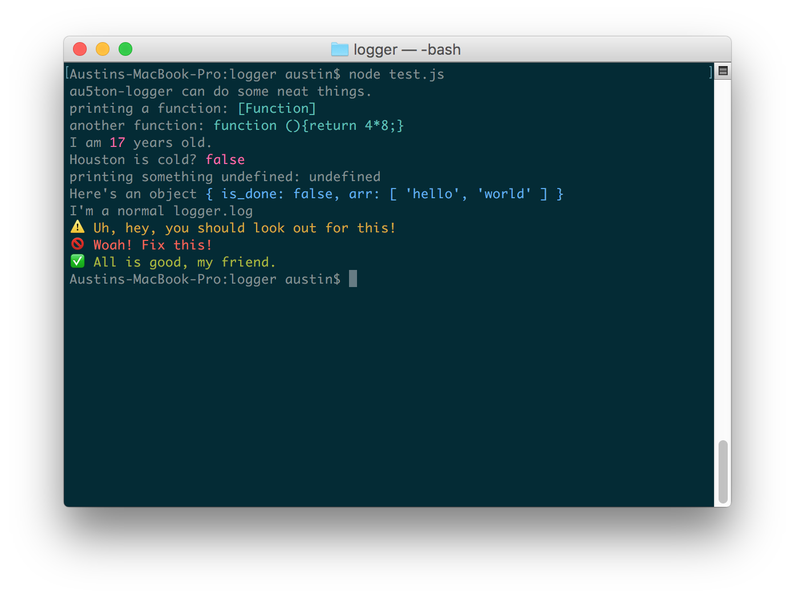

# logger
console.log() is too boring for me, so I wrote an npm module.

#### Installation:
1. Run: `npm install au5ton-logger --save`
2. Add the following code:
```javascript
var client = require('au5ton-logger');
```

## Example code

#### Code
```javascript
logger.log('au5ton-logger can do some neat things.');
logger.log('printing a function: ',function(){return 2+2;});
logger.setOption('function_omission', false);
logger.log('another function: ',function(){return 4*8;});
logger.setOptions(logger.default);
logger.log('I am ', 17, ' years old.');
logger.log('Houston is cold? ', false);
var something;
logger.log('printing something undefined: '+something);
var obj = {
    is_done: false,
    arr: ['hello', 'world']
};
logger.log('Here\'s an object ', obj);
logger.log('I\'m a normal logger.log');
logger.warn('Uh, hey, you should look out for this!');
logger.error('Woah! Fix this!');
logger.success('All is good, my friend.');
```
#### Result



## This is just another logger!

Yes, this is a logger that fits *my* personal style. I think it's pretty. You don't have to use it, but I will.

## Features

### Automatic Formatting

#### Choose when to format naturally

In order for this logger to properly format/color your objects, they need to be separate arguments separated by commas. You can use this intentionally to tell what you do and don't want formatted.

won't format: `logger.log('i am '+17+' years old');` &rarr; 'i am 17 years old'

will format: `logger.log('i am ',17,' years old');` &rarr; 'i am 17 years old'

#### Sequential data

logger also automatically puts spaces between sequential arguments that aren't strings. Don't waste your time formatting everything!

Desired output:
```
{ hello: 'world' } 3.1415 { more: 'string', data: false }
```

Conventional approach :-1:
```javascript
console.log(util.inspect(obj1)+' '+Math.PI+' '+util.inspect(obj2));
//Or
console.log(obj1,' ',Math.PI,' ',obj2);
```

logger :sparkles::
```javascript
logger.log(obj1,Math.PI,obj2);
```

#### Pretty calls for usual cases

Includes logger.warn, logger.error, and logger.success that color all output and have symbolic emoji at the start of the line. (See example code screenshot)

```javascript
logger.log('I\'m a normal logger.log');
logger.warn('Uh, hey, you should look out for this!');
logger.error('Woah! Fix this!');
logger.success('All is good, my friend.');
```

### Used to another language?

logger also aliases (or ["monkey patches"](https://developer.mozilla.org/en-US/docs/Web/JavaScript/Reference/Global_Objects/Function/apply#Using_apply_in_monkey-patching)) itself with helpful methods for people who are more familiar with other languages instead of JavaScript, or just like different terms.

- logger.println === logger.log
- logger.puts === logger.log
- logger.Println === logger.log
- logger.Print === logger.print

## API

### logger.print(args)

prints arguments to screen (very fancy)

valid example: `logger.print('emoji', 2, {hello: 'world'}, 'more strings')`

### logger.log(args)

same as logger.print, but adds '\n'

### logger.warn(args)

same as logger.log, but all text is yellow and the line starts with :warning:

### logger.error(args)

same as logger.log, but all text is red and the line starts with :no_entry_sign:

### logger.success(args)

same as logger.log, but all text is green and the line starts with :white_check_mark:

### logger.setOptions(options) & logger.setOption(key,val)

logger has different features (other than coloring) that I like, which prompted me to make it.

logger internally includes this `options` object with default option values. Some are self-explanatory, but I'll explain them all.

`logger.setOptions` replaces this object with what you provide. Make sure to specify everything, otherwise errors will occur! If you want to reset it to the default, use `logger.setOptions(logger.default)`

`logger.setOption` (notice the plural vs singular) replaces only the option you specify in the `key` parameter. To edit the `enabled_colors`, use logger.enableColor(color) & logger.disableColor(color)

valid example: `logger.setOption('emoji', true)`

```javascript
let options = {
    //enables or disables emoji before logger.warn,
    //logger.error, and logger.success methods
    emoji: true,
    //different `typeof` javascript variables are colored differently when printed with logger, in addition to logger.warn, logger.error, and logger.success. The `typeof`s present in this array are colored differently from the default terminal color when printed with logger (see screenshot above). If it's not present, its color is unaffected.
    enabled_colors: [
        'function',
        'number',
        'boolean',
        'undefined',
        'object',
        'warn',
        'error',
        'success'
    ],
    //if true, print `[Function]` when attempting to print a function. if false, print the code inside the function.
    function_omission: true,
    //if true, call the .toString() when attempting to print an object. if false, print the JSON string of an object.
    object_omission: false,
    //if true, timestamp each print in this prefix: [YYYY/MM/DD @ HH:MM:SS]
    prefix_date: false
};
```

### logger.enableColor(color) & logger.disableColor(color)

adds and removes `color` from `enabled_colors` where `color` is a valid string for `enabled_colors`. You can also specify `*` for either method to enable or disable all colors.

valid example: `logger.disableColor('boolean')`

valid example: `logger.disableColor('number')`

valid example: `logger.enableColor('object')`

valid example: `logger.enableColor('*')`
