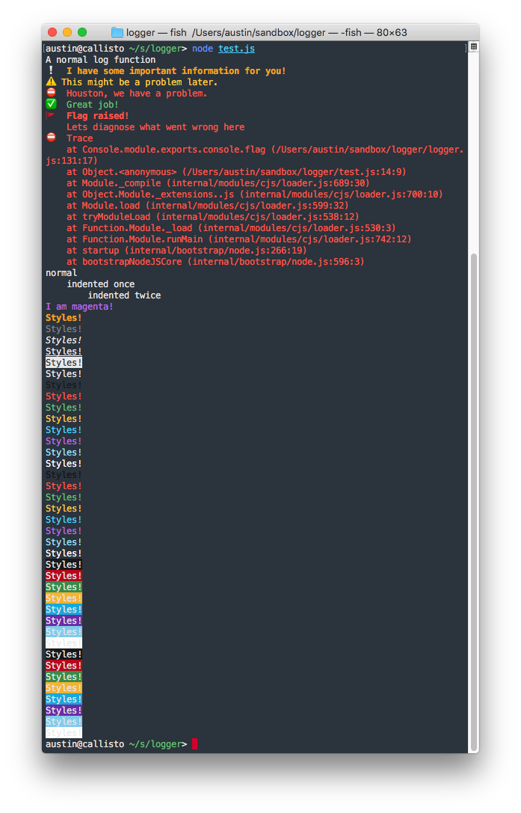

# logger
console.log() is too boring for me, so I wrote an npm module that hijacks it.

## Installation:
1. Run: `npm install au5ton-logger`
2. Add the following code:
```javascript
require('au5ton-logger')();

// or with some options (only initialize it once)

require('au5ton-logger')({
    emoji: true, // uses emoji in print messages
    prefix_date: false, // prefixes with [YYYY/MM/DD @ HH:MM:SS]
    tab_size: 4, // amount of spaces to use when console.ind() is called
});
```

## Example code

```javascript
require('./logger')()

// Different styles of prints
console.log('A normal log function')
console.info('I have some important information for you!')
console.warn('This might be a problem later.')
console.error('Houston, we have a problem.')
console.success('Great job!')

// Easy Identation
console.log('normal');
console.ind().log('indented once');
console.ind(2).log('indented twice');

// Chalk integration
let chalk = console.chalk
console.log(chalk.magenta('I am magenta!'))

let methods=['bold','dim','italic','underline','inverse','strikethrough','black','red','green','yellow','blue','magenta','cyan','white','gray','redBright','greenBright','yellowBright','blueBright','magentaBright','cyanBright','whiteBright','bgBlack','bgRed','bgGreen','bgYellow','bgBlue','bgMagenta','bgCyan','bgWhite','bgBlackBright','bgRedBright','bgGreenBright','bgYellowBright','bgBlueBright','bgMagentaBright','bgCyanBright','bgWhiteBright'];
for(let i in methods) {
    // Calls every console.<modifier> function. Example: console.bold, console.cyan
    console[methods[i]]('Styles!')
}
```
### Result


[](https://app.fossa.io/projects/git%2Bgithub.com%2Fau5ton%2Flogger?ref=badge_shield)


## API

### `console.info(args)`

same as built-in `console.info`, but all text is bold and the line starts with :grey_exclamation:

### `console.warn(args)`

same as built-in `console.warn`, but all text is yellow and the line starts with :warning:

### `console.error(args)`

same as built-in `console.error`, but all text is red and the line starts with :no_entry_sign:

### `console.success(args)`

same as `console.log`, but all text is green and the line starts with :white_check_mark:

### `console.ind(n)`

Prints ' ' `options.tab_size * n` times, returns `console` to allow chaining

### `console.nl(n)`

Prints '\n' times, returns `console` to allow chaining

### `console.chalk`

A [`chalk`](https://github.com/chalk/chalk) instance.

### `console.<chalk_function>`

Prints a shortcut to a chalk function. For example, `console.blue('hello')` equals `console.log(chalk.blue('hello'))`

For valid methods, see [logger.js](https://github.com/au5ton/logger/blob/6bbae18430360801aaa3ba2af81f40a28a913139/logger.js#L122-L165)

## License
[](https://app.fossa.io/projects/git%2Bgithub.com%2Fau5ton%2Flogger?ref=badge_large)